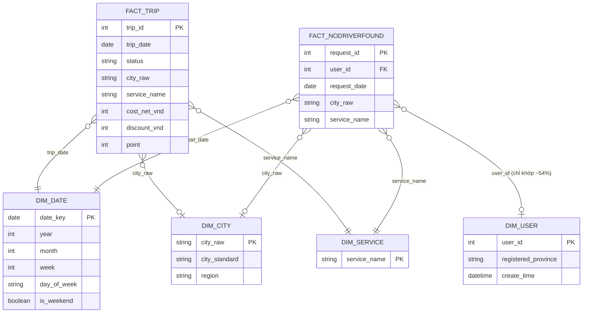

# PHẦN B — BUSINESS QUESTIONS · PHẦN C — KPI DICTIONARY · PHẦN D — SEMANTIC MODEL
## BUTL 2025 — sau khi đã xác nhận giới hạn dữ liệu (xem A.9)

> **Lưu ý:** đây là dữ liệu vận hành THẬT của BUTL (2025). Mọi số liệu tài chính tuyệt đối (VNĐ) trong tài liệu này đã được ẩn danh hóa hoặc chuyển thành số tương đối trước khi công khai — xem README.md mục "Bảo mật dữ liệu".

Quy ước trạng thái: ✅ Khả thi đầy đủ · ⚠️ Khả thi một phần / cần proxy · ❌ Không khả thi với dữ liệu hiện có

---

# PHẦN B — BUSINESS QUESTIONS

## CASE 1 — Voucher push nhiều nhưng chuyển đổi thấp

**Giới hạn nền tảng:** không có bảng voucher/campaign, không có mã định danh từng voucher, không có ngày phát hành/hạn dùng, không có kênh phát. Chỉ có `discount_from_code` (số tiền giảm trên 1 trip, có giá trị ở 1,3% số trip) và `point` (điểm thưởng, độc lập phần lớn với discount).

| # | Câu hỏi gốc | Trạng thái | Lý do / điều kiện | Priority |
|---|---|---|---|---|
| 1 | Voucher nào phát nhiều nhưng dùng thấp? | ❌ | Không có ID voucher, không có số lượng "phát" (issued) | — |
| 2 | Voucher nào có redemption rate & incremental trip tốt? | ❌ | Không có mẫu số "issued" theo từng voucher | — |
| 3 | Mức giảm bao nhiêu hiệu quả nhất? | ⚠️ | Có thể xem phân phối `discount_from_code` theo Completion Rate của trip đó (không phải "hiệu quả voucher" thật, chỉ là tương quan mức giảm ↔ trạng thái trip) | Medium |
| 4 | Khung giờ/ngày/địa phương nào chuyển đổi tốt? | ⚠️ | Đổi nghĩa: xem tỷ lệ trip **có discount** theo giờ/ngày/địa phương — không phải "chuyển đổi voucher" thật | Medium |
| 5 | New/existing/at-risk/churned user phản ứng khác nhau thế nào với voucher? | ❌ | Không join được user↔trip | — |
| 6 | Voucher tạo thêm chuyến hay chỉ subsidize nhu cầu sẵn có (incremental)? | ❌ | Cần control group/A-B, không có trong data này | — |
| 7 | Chi phí khuyến mãi tập trung vào nhóm nào? | ❌ | Không có customer segment gắn với trip | — |
| 8 | Nhóm nào nên tăng/giảm/ngừng voucher? | ❌ | Phụ thuộc câu 5, 7 | — |
| 9 | Bao nhiêu voucher hết hạn chưa dùng? | ❌ | Không có bảng "issued" để so với "used" | — |
| 10 | Thời gian từ nhận đến dùng voucher? | ❌ | Không có ngày phát hành voucher | — |

**Kết luận Case 1:** chỉ còn lại 1 sub-dashboard mô tả ở mức tổng thể ("Discount Usage Overview" — không phải "Voucher Performance funnel" như đề bài gốc yêu cầu).

---

## CASE 2 — Tỷ lệ huỷ chuyến & không tìm thấy tài xế cao

**Nền tảng khả dụng:** `raw_trip.status` (Completed/Cancelled + 3 trạng thái in-progress), `raw_notfound` (toàn bộ là "no driver found"), cả hai có `city`, `service_name`, `create_date` đầy đủ.

| # | Câu hỏi gốc | Trạng thái | Lý do / điều kiện | Priority |
|---|---|---|---|---|
| 1 | Tỷ lệ completed/cancelled/no-driver-found theo thời gian | ✅ | Trực tiếp từ status + notfound | High |
| 2 | Địa phương/dịch vụ/khung giờ/ngày nào tỷ lệ lỗi cao | ✅ | Có city, service, giờ/ngày từ create_date (32–36% dòng thiếu city, sẽ loại khỏi phân tích theo city) | High |
| 3 | Huỷ chuyến xảy ra ở bước nào, do khách/tài xế/hệ thống | ❌ | Không có reason/actor field | — |
| 4 | Lý do huỷ phổ biến nhất | ❌ | Không có cột lý do | — |
| 5 | No-driver-found liên quan đến demand cao/thiếu supply/khung giờ cao điểm? | ⚠️ | Có thể xem tương quan theo khung giờ & city (demand proxy = volume trip+notfound cộng lại); không có dữ liệu tài xế active nên không đo được "thiếu supply" trực tiếp | Medium |
| 6 | Thời gian tìm tài xế ảnh hưởng tỷ lệ huỷ? | ❌ | Không có timestamp bắt đầu tìm tài xế / matching time | — |
| 7 | Voucher tăng demand ở khu vực thiếu tài xế? | ❌ | Phụ thuộc Case 1 (không khả thi) | — |
| 8 | Nhóm khách hàng nào huỷ nhiều? | ❌ | Không join được user↔trip | — |
| 9 | Sau cancelled/no-driver-found khách có quay lại không? | ⚠️ | Chỉ đo được ở mức `raw_notfound.user_id`: user có notfound nhiều lần có tiếp tục notfound không — **không** đo được liệu họ có hoàn tất trip sau đó (vì trip không có user_id) | Low — cần nêu rõ giới hạn khi trình bày |
| 10 | Ưu tiên vận hành ở địa phương/khung giờ nào? | ✅ | Suy ra trực tiếp từ #1, #2 | High |

**Kết luận Case 2:** Đây là case **khả thi nhất** — giữ nguyên gần hết mục tiêu Dashboard 3 (Trip Failure & Driver Supply) trong đề bài gốc, trừ phần liên quan actor/reason/matching-time/driver supply thật.

---

## CASE 3 — Khách hàng cũ chiếm 70% chuyến nhưng retention thấp

**Giới hạn nền tảng:** không có user_id hợp lệ trong `raw_trip` → không thể xác định trip nào thuộc về khách mới hay khách cũ, không thể dựng cohort hay đo repeat rate theo từng người.

⚠️ **Lưu ý quan trọng:** giả định "70% chuyến từ khách cũ" nêu trong bối cảnh kinh doanh **không thể kiểm chứng lại** bằng bộ dữ liệu này — cần xem đây là input đã có từ trước (từ hệ thống nguồn), không phải con số dashboard này tái tạo ra được.

| # | Câu hỏi gốc | Trạng thái | Lý do / điều kiện | Priority |
|---|---|---|---|---|
| 1 | Tỷ trọng chuyến new/existing user theo tháng | ❌ | Không join được — chỉ còn: so sánh **số user đăng ký mới** (từ `raw_user`) với **tổng volume trip** theo tháng, đây là 2 chỉ số riêng biệt, không phải tỷ trọng thật | — |
| 2 | Bao nhiêu khách chỉ hoàn thành đúng 1 chuyến? | ❌ | Cần user_id hợp lệ trên trip | — |
| 3 | Tỷ lệ khách đi chuyến 2, 3, 4 | ❌ | nt | — |
| 4 | Thời gian trung vị chuyến 1→2 | ❌ | nt | — |
| 5 | Retention D7/14/30/60/90 | ❌ | nt | — |
| 6 | Cohort retention theo tháng chuyến đầu | ❌ | nt | — |
| 7 | Nhóm khách nào churn mạnh nhất | ❌ | nt | — |
| 8 | Service/địa phương/voucher đầu/trải nghiệm đầu liên quan churn? | ❌ | nt | — |
| 9 | Khách từng cancelled/no-driver-found có retention thấp hơn? | ❌ | Không đo được retention nói chung nên không so sánh được | — |
| 10 | Chuyến đi tập trung vào nhóm khách nào, rủi ro phụ thuộc? | ❌ | nt | — |
| 11 | Nhóm nào nên nhận chiến dịch kích hoạt chuyến 2? | ❌ | nt | — |
| 12 | Dự báo nguy cơ churn theo RFM? | ❌ | nt | — |

**Kết luận Case 3:** **Không triển khai được** ở cấp độ khách hàng với dữ liệu hiện tại. Phần duy nhất giữ lại được là xu hướng **New Registered User theo tháng** (từ `raw_user`) trình bày song song với **tổng Booking Volume theo tháng** (từ `raw_trip`) — 2 đường trend riêng biệt, ghi rõ đây không phải "tỷ trọng trip theo user type".

---

# PHẦN C — KPI DICTIONARY (chỉ các KPI khả thi hoặc có proxy rõ ràng)

## C.1 Trip & Revenue

| KPI | Business Definition | Numerator | Denominator | Grain | Filter | Cảnh báo |
|---|---|---|---|---|---|---|
| Total Booking | Tổng số lượt đặt chuyến phát sinh | COUNT(trip.id) | — | Ngày/Tháng | Không lọc status | Bao gồm cả cancelled |
| Completed Trip | Số chuyến hoàn tất | COUNT(trip.id) WHERE status='Chuyến đi hoàn tất' | — | Ngày/Tháng | status=Completed | — |
| Cancelled Trip | Số chuyến bị huỷ | COUNT(trip.id) WHERE status='Đã huỷ' | — | Ngày/Tháng | status=Cancelled | — |
| No Driver Found Trip | Số lượt không tìm được tài xế | COUNT(notfound.id) | — | Ngày/Tháng | bảng notfound | Không cùng bảng với trip — khi cộng chung "tổng nhu cầu" phải UNION 2 nguồn, không JOIN |
| Completion Rate | % booking hoàn tất trên tổng nhu cầu | Completed Trip | Total Booking + No Driver Found Trip | Ngày/Tháng | — | Denominator phải cộng cả notfound để phản ánh đúng "tổng nhu cầu", nếu chỉ chia trong bảng trip sẽ bị lệch |
| Cancellation Rate | % booking bị huỷ trên tổng booking (bảng trip) | Cancelled Trip | Total Booking | Ngày/Tháng | — | — |
| No Driver Found Rate | % tổng nhu cầu bị no-driver-found | No Driver Found Trip | Total Booking + No Driver Found Trip | Ngày/Tháng | — | — |
| Net Revenue | Doanh thu thực thu (đã trừ discount) | SUM(trip.cost) WHERE status=Completed | — | Ngày/Tháng | Chỉ tính trip completed | Đã xác nhận `cost` là net; **không** có Gross/Net Revenue phân biệt chi phí vận hành khác |
| Gross Value (trước discount) | Giá trị trước khi trừ khuyến mãi | SUM(trip.cost + discount_from_code) | — | Ngày/Tháng | Completed | Proxy — giả định discount là khoản trừ duy nhất |
| Average Order Value (AOV) | Giá trị trung bình 1 chuyến hoàn tất | Net Revenue | Completed Trip (count) | Ngày/Tháng/City/Service | Completed | Loại 3 dòng cost=0 (nghi lỗi) trước khi tính nếu cần |

## C.2 Discount / Point (thay thế Voucher KPI — xem giới hạn Case 1)

| KPI | Business Definition | Numerator | Denominator | Grain | Cảnh báo |
|---|---|---|---|---|---|
| Discount Usage Rate | % chuyến có áp dụng discount_from_code | COUNT(trip WHERE discount_from_code>0) | Total Booking | Ngày/Tháng/City/Service | **Không phải Voucher Redemption Rate** — không có mẫu số "issued" |
| Average Discount Value | Số tiền giảm trung bình trên chuyến có discount | SUM(discount_from_code) WHERE >0 | COUNT(trip WHERE discount_from_code>0) | Ngày/Tháng | — |
| Discount-to-Revenue Ratio | Tỷ trọng chi phí giảm giá trên tổng giá trị gross | SUM(discount_from_code) | SUM(cost+discount_from_code) | Ngày/Tháng | Chỉ phản ánh phần discount_from_code, chưa gồm chi phí point | 
| Point Usage Rate | % chuyến có phát sinh point | COUNT(trip WHERE point>0) | Total Booking | Ngày/Tháng | Chưa rõ point là "được cộng" hay "được dùng trừ tiền" trên chính dòng này — cần xác nhận thêm nếu muốn quy đổi ra VNĐ chính xác |

## C.3 Operations (Case 2)

| KPI | Business Definition | Numerator | Denominator | Grain | Cảnh báo |
|---|---|---|---|---|---|
| Failure Rate theo City | % (Cancelled+NoDriverFound) trên tổng nhu cầu tại 1 city | Cancelled(city) + NoDriverFound(city) | TotalBooking(city) + NoDriverFound(city) | City × Ngày/Tháng | 32–36% dòng thiếu city → nhóm riêng "Không xác định", không loại bỏ âm thầm |
| Failure Rate theo khung giờ | tương tự, theo giờ trong ngày | — | — | Hour × ngày trong tuần | — |
| Peak Demand Index | Tổng nhu cầu (trip+notfound) theo khung giờ, so với trung bình | — | — | Hour | Proxy cho "cao điểm", không thay thế được dữ liệu tài xế active thật |
| Notfound Repeat Rate (theo user) | % user trong notfound có ≥2 lần thất bại trong năm | COUNT(DISTINCT user_id WHERE attempts≥2) | COUNT(DISTINCT user_id) trong notfound | Năm | Chỉ áp dụng nội bộ bảng notfound — không nối được sang trip |

## C.4 User (Case 3 — rất giới hạn)

| KPI | Business Definition | Numerator | Denominator | Grain | Cảnh báo |
|---|---|---|---|---|---|
| New Registered User | Số user tạo tài khoản mới | COUNT(user.user_id) | — | Ngày/Tháng | — |
| Registered Province Mix | Phân bố user theo tỉnh/thành đăng ký | COUNT(user_id) theo `name` | Tổng user có `name` khác null (chỉ 21% có giá trị) | — | 79% null — chỉ mang tính minh hoạ, không đại diện toàn bộ |

**KPI KHÔNG đưa vào Dictionary vì không khả thi:** toàn bộ Voucher funnel KPI (Issued/Claimed/Redeemed/Time-to-Redeem/Expired Unused/Cost per Activated User/Incremental Trip), toàn bộ Retention/Repeat/Cohort/RFM/Lifecycle KPI, Driver Matching Time, Cancellation theo actor/reason, Driver Supply Gap — đã liệt kê chi tiết ở Phần A.6.

---

# PHẦN D — SEMANTIC MODEL (đơn giản hoá theo dữ liệu thật)

Vì không có foreign key hợp lệ giữa `raw_trip` và `raw_user`, mô hình star schema **không** thể dựng như đề xuất ban đầu (Fact_Trips liên kết Dim_User). Mô hình thực tế:

**Điểm khác biệt quan trọng so với đề xuất gốc:**
- ❌ Không có quan hệ `FACT_TRIP → DIM_USER` (lý do: `raw_trip.user_id` không hợp lệ — xem A.9).
- `FACT_NODRIVERFOUND → DIM_USER` là **left join không đầy đủ** (chỉ ~54% user_id khớp) — trong Tableau nên dùng **LEFT JOIN + flag "user_id không xác định"**, không dùng INNER JOIN (sẽ làm mất ~46% dòng notfound một cách âm thầm).
- `DIM_CITY` cần bảng mapping chuẩn hoá riêng (city_raw → city_standard) do dữ liệu gốc không đồng nhất tiền tố "Tỉnh/Thành phố".
- Không có `FACT_VOUCHER`, `DIM_DRIVER`, `DIM_CAMPAIGN`, `DIM_CANCELLATION_REASON` — không dựng được vì không có dữ liệu nguồn.
- `FACT_TRIP` và `FACT_NODRIVERFOUND` **không JOIN trực tiếp với nhau** — muốn xem "tổng nhu cầu" phải UNION theo (date, city, service), không phải JOIN theo id (2 hệ ID độc lập, chỉ trùng ngẫu nhiên ~53%).

Cardinality: `DIM_DATE` 1—n `FACT_TRIP`; `DIM_DATE` 1—n `FACT_NODRIVERFOUND`; `DIM_USER` 1—n `FACT_NODRIVERFOUND` (partial); `DIM_CITY`/`DIM_SERVICE` 1—n cả 2 fact table.
